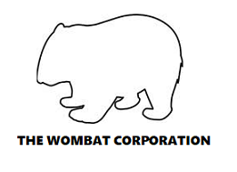

  

The Wombat Corp. has been working hard on their blog about Wombats, so hard in fact that their team is cutting corners with security to get their blog ready to launch! This obviously isn't the best way to do things and we need to show The Wombat Corp. what vulnerabilities their network has before the website goes online. Can you find your way into each machine and collect the hidden secrets? Make sure to document each step of the way.

## Directions
1. The attached .zip has the images to each VM used in this virtual lab
      -https://drive.google.com/file/d/1yzKgSD5W_0qB0rIX-_3pszaBK0Ciaz5B/view?usp=sharing
2. Once setup, only one box should be accessible. You must compromise this box to move forward.
3. Each company secret is named proof.txt
4. There is more than two company secrets, but no more than seven?
